# Порівняння представлення графів у базах даних SQL та Neo4j
## 1. Графи: Загальні відомості
### Що таке граф?
Граф — це сукупність об'єктів із зв'язками між ними.
Об'єкти розглядаються як вершини, або вузли графу, а зв'язки — як дуги, або ребра.

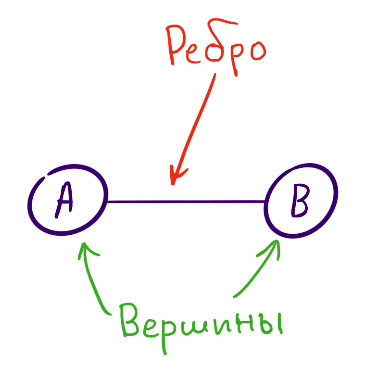

Ребра графа можуть бути направленими або ненаправленими, а такі графи відповідно називаються орієнтованими або неорієнтованими.

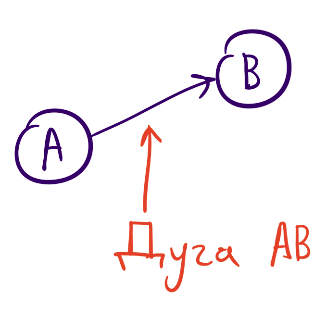

Якщо вершина графа з'єднана ребром сама з собою, то таке ребро називається петлею.

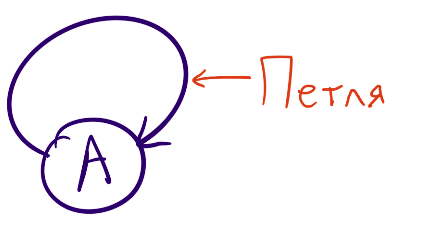

### Отримання підграфів
Граф називається підграфом якщо його вершини і ребра є підмножинами вершин і ребер іншого графа.
Всякий підграф може бути отриманий з графа видаленням деяких вершин і ребер.
Коли ми маємо великий граф і нам цікава лише певна його частина, тоді краще створити підграф.

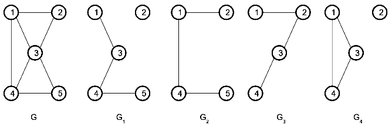

### Пошук шляхів
Шлях в графі — це скінченна або нескінченна послідовність ребер в якій кожні два сусідні ребра мають спільну вершину.
Довжина маршруту дорівнює кількості ребер у ньому (причому кожне ребро вказується стільки разів, скільки воно зустрічається в даному маршруті).
Пошук шляху по графу — це процес проходження кожної вершини графу.
Такі алгоритми пошуку класифікують відповідно до порядку проходження вершин.

__Пошук у глибину__ по графу це алгоритм, який проходить дочірні вершини, перш ніж буде проходити вершини того ж рівня.
Для цього використовується стек.

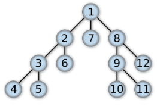

__Пошук у ширину__ це інша техніка пошуку по скінченному графу.
Цей алгоритм проходить суміжні вершини перш ніж переходити до дочірніх вершин, і як процес пошуку використовується черга.
Цей алгоритм часто використовується для пошуку найкоротшого шляху від однієї вершини до іншої.

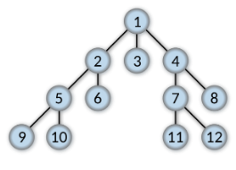

### Де використовуються графи?
Графи використовуються в геоінформаційних системах, логістиці, соціальних мережах, магазинах та інших сферах життя.

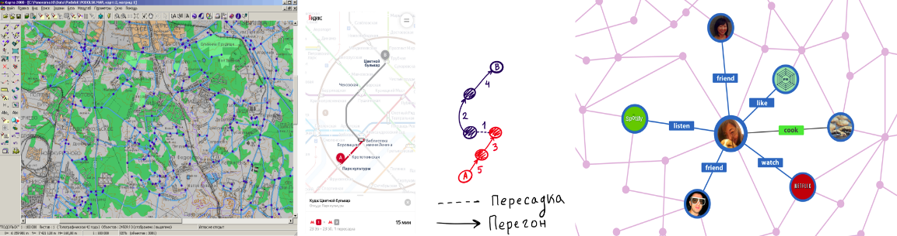

## 2. Neo4j
__Neo4j__ - open-source графова база даних, історія якої почалася з інвестицій компанії "Neo Technology" в 2003 році. Стала публічно доступною тільки з 2007.  
В Neo4j присутні всі характеристики баз даних, включаючи дотриманн ACID, розбиття на кластери і відновлення після збо в системі.  
На сьогоднішній день - лідер серед графових баз данних

Компоненти графової бази даних - це вузли та ребра. Вони можуть бути доповнені властивостями (__properties__). Модель такої БД схематично зображена на малюнку:  


### Встановлення Neo4j
[Сайт Neo4j](https://neo4j.com/download/)   
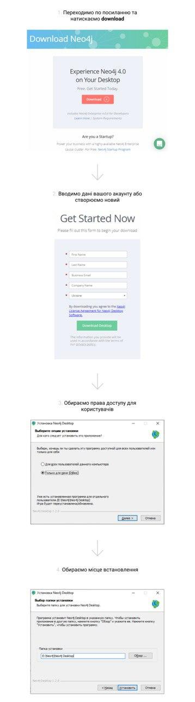  
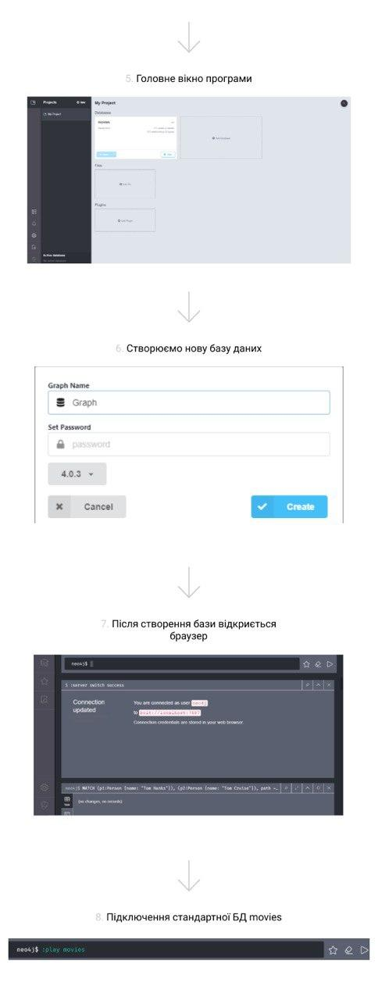


### Приклади стандартних команд
1. Вибрати всі ноди з БД та повернути їх
```cypher
MATCH (n) RETURN n
```
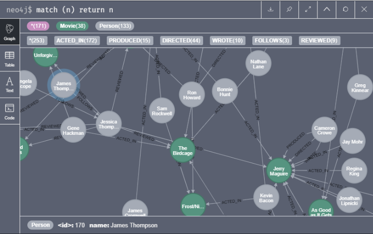  


2. Вибрати всі ноди з типом __Movie__ та повернути їх 
```cypher
MATCH (n:Movie) RETURN n;
```
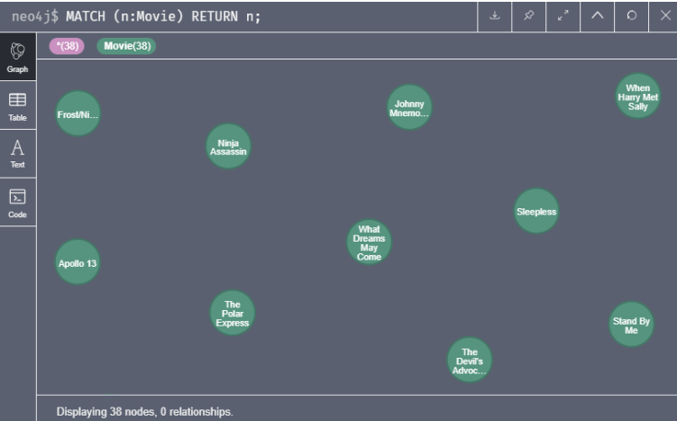  


3. Вибрати конкретну ноду з типом __Movie__ та назвою __The Matrix__, повернути її
 ```cypher
MATCH (n: Movie { title: "The Matrix" }) RETURN n
 ```
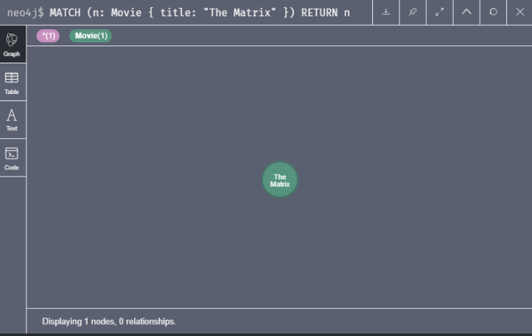  


4. Вибрати ноду з ім'ям __Keanu Reeves__, а також ноди з якими він пов'язаний, повернути їх
 ```cypher
MATCH (n:Person {name:"Keanu Reeves"}) --> (g) RETURN n,g;
 ```
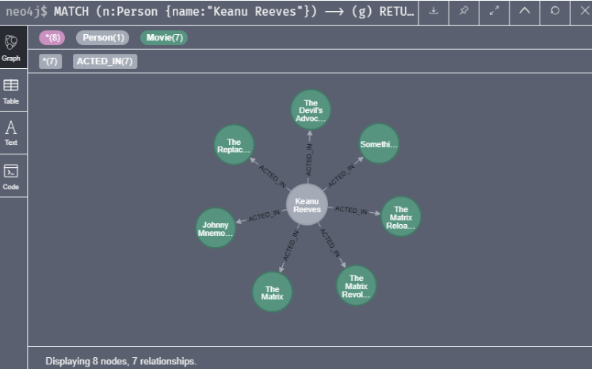  
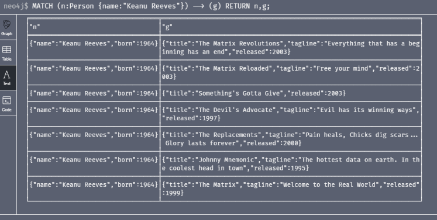  


5. Те саме, що й попередній запит, але також повернає зв'язки між нодами
 ```cypher
MATCH (n:Person {name:"Keanu Reeves"}) -[k]-> (g) RETURN n,g,k;
 ```
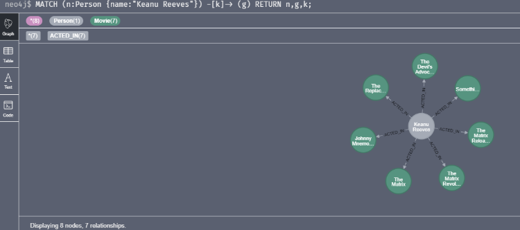  
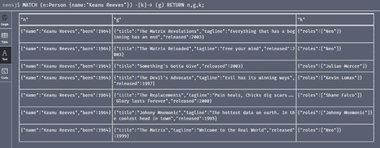  

### Задачі
#### 1. Вивід властивостей
У кожної з нод у нас може бути безліч властивостей, але ми можемо отримати тільки те, що нам потрібно.

Наприклад:
```cypher
MATCH (g)-[k]->(n:Movie {title:"The Matrix"}) RETURN n.released,g.born,k;
```
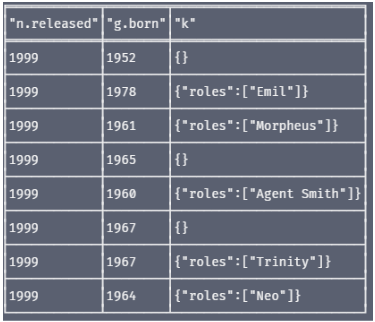  

Цей запит поверне дати народження акторів і дати випуску фільму.
 
#### 2. Пошук підграфу 
Одна з особливостей мови Cypher - це функція, яка дозволяє знайти найкоротший шлях з точки зору кількості зв'язків між двома вершинами.

Використовуючи граф фільму, який можна імпортувати за допомогою команди `:play movies` в браузері, створимо відносини «_KNOWS_» між людьми, які з'являлися в одному фільмі:
```cypher
MATCH (p1:Person)-[:ACTED_IN]->()<-[:ACTED_IN]-(p2:Person)
MERGE (p1)-[:KNOWS]-(p2)
```

Тепер, коли у нас є ці зв'язки, ми можемо легко знайти найкоротший шлях між двома людьми, скажімо, Томом Крузом і Томом Хенксом:

```cypher
MATCH (p1:Person {name: "Tom Hanks"}), (p2:Person {name: "Tom Cruise"}),
      path = shortestpath((p1)-[:KNOWS*]-(p2))
RETURN path
```
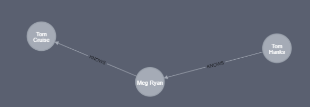

## 3. Представлення графової структури в реляційній моделі

Реляційна модель передбачає зберігання даних у вигляді таблиць. Тому треба придумати спосіб переведення графової структури в модель «сутність-зв’язок». Описати звичайний математичний граф можна за допомогою множин вершин та зв’язків. На схемі це таблиці з назвами **nodes** та **connections** відповідно. Для можливості формування напрямлених зв’язків у таблиці **connections** є два поля, які вказують з якої та до якої вершини йде зв’язок (**node_source** та **node_target**). Ненапрямлений зв’язок у такому представленні можна визначити, якщо з’єднати пару вершин двома напрямленими дугами з протилежними значеннями **node_source** та **node_target**. 
Окрім цього, Neo4j передбачає також можливість задання для кожної вершини та кожного зв’язку необмежену кількість властивостей типу «ключ-значення». Для цього було введено ще дві таблиці – **node_properties** та **connection_properties**, які зберігають ці властивості. Таким чином, отримали схему, зображену на рисунку.

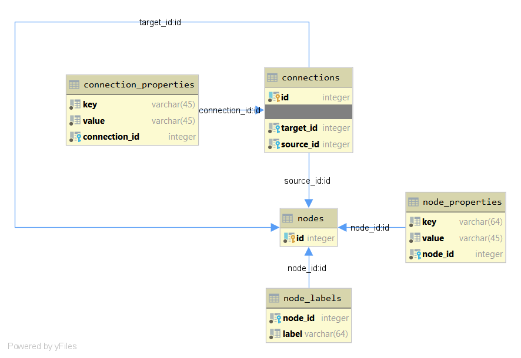

Тепер спробуємо переписати попередні запити (Cypher) мовою MySQL, щоб порівняти зручність.

1.Пошук фільма за його назвою.

```SQL
SELECT * FROM cytrus.node_properties
WHERE value = 'The Matrix';
```
Зрозуміло, що такий простий запит не складно написати будь-якою мовою. Далі «перекладемо» другий запит.

2.Пошук людей, що брали участь в заданому фільмі.

```SQL
SELECT node_properties.value AS "Name", m.value AS "Relation", movie AS "Movie" FROM ( 
    SELECT node_properties.value AS movie, node_id, source_id, connection_properties.value FROM node_properties 
    JOIN connections ON target_id = node_id
    JOIN connection_properties ON connections.id = connection_properties.connection_id
    WHERE node_properties.key = 'title' AND node_properties.value = 'The Matrix'
        AND connection_properties.key = 'TYPE'
) m
JOIN node_properties ON m.source_id = node_properties.node_id
WHERE node_properties.key = 'name'
```

На цьому прикладі вже явно видно перевагу мови Cypher. Мови у реляційних базах даних погано адаптовані до пошуку у графі вершин, які зв'язані з іншими. Для цього доводиться будувати допоміжну таблицю (вкладений запит ```SELECT```), в якій будуть всі зв'язки до заданої вершини і з цієї таблиці вже вибирати ті вершини, з яких йдуть зв'язки до вершини-фільму. І це лише другий рівень вкладеності. 

Для третього запиту, де доведеться шукати усі зв'язки із фільмом, потрібно буде створювати проміжну таблицю для кожного наступного рівня глибини пошуку. А оскільки ми не знаємо, на якому рівні закінчуються зв'язки, то написати вручну такий запит не видається можливим. Натомість, це можна зробити програмно, проте створення такого алгоритму наразі виходить за межі цілей нашого проекту. Він та інші алгоритми для операцій з графами будуть створені в подальшому та дозволять користувачу абстрагуватися від реляційної моделі, як це вже зроблено у Neo4j.

## 4. Data Access Object
Перед нами стояла така задача:

1. Під'єднатися до Neo4j, де завантажена певна база даних;
2. Вивантажити дані з Neo4j;
3. Завантажити їх у реляційну базу даних на SQL.

Модулі для роботи Neo4j та SQL логічно повинні бути окремими елементами, що працюють незалежно одне від одного.

У даному випадку Neo4j виконує роль донора даних — для неї виконуються лише операції зчитування, тоді як над реляційною базою — лише операції запису.
Для більшої універсальності рішення та з огляду на можливі майбутні потреби, було прийнято рішення реалізувати основні CRUD операції в обох випадках.

Для взаємодії двох частин програми розроблено два дата-класи, що містять інформацію про вершини графу та зв'язки між ними відповідно:

```kotlin
data class NodeData(
    val id: Long,
    val labels: Iterable<String>,
    val properties: Map<String, Any>
)

data class RelationshipData(
     val id: Long,
     val startNodeId: Long,
     val endNodeId: Long,
     val type: String,
     val properties: Map<String, Any>
)
```

Цими класами ми оперуємо в програмі безпосередньо, без взаємодії з базою даних. Вони представляють конкретні сутності графу у програмі, без прив'язки до Neo4j чи SQL.

Для взаємодії з Neo4j обрано патерн __Data Access Object__. Схематично, його можна зобразити так:


Тобто бізнес-логіка у ролі контролеру робить запити до DAO, який надає інтерфейс для виконання CRUD-операцій над базою даних.
DAO інкапсулює в собі безпосередні звернення до БД мовою маніпуляції даними (DML) і приховує їх від бізнес-логіки.
Отриманий результат виконання запитів DML DAO транслює у формати, що підтримуються предметною областю.
У нашому випадку — це класи `NodeData` i `RelationshipData`.

Об'єктом доступу до даних Neo4j у нас є клас [Neo4jConnector](https://github.com/NeProgramist/Cytrus/blob/master/src/main/kotlin/connectors/Neo4jConnector.kt).

```kotlin
class Neo4jConnector(uri: String?, user: String?, password: String?) : AutoCloseable {
    private val driver: Driver = GraphDatabase.driver(uri, AuthTokens.basic(user, password))
    /* ... */
    override fun close() { driver.close() }
    /* ... */
}
```

При створенні екземпляру класу встановлюється з'єднання з Neo4j згідно із заданими адресою, логіном та паролем.
Neo4j працює за допомогою протоколу <b>bolt</b>, тому перший параметр матиме вигляд типу `bolt://localhost:7687`.
Імплементація інтерфейсу `AutoCloseable` вимагає від нашого класу визначити метод `close()` для завершення з'єднання. Він може викликатися системою автоматично.

Перш, ніж перейти до визначення власне CRUD-API, розберемося, як Neo4jConnector працює з базою даних.
Для виконання Cypher-запитів існує відповідний метод, що повертає результат запиту за допомогою колбека:

```kotlin
    fun query(cipher: String, cb: (Record) -> Unit = {}) {
        driver.session().use { session ->
            session.readTransaction { tx ->
                val result = tx.run(cipher)
                while (result.hasNext()) cb(result.next())
            }
            session.close()
        }
    }
```

Згідно з визначенням патерна DAO, цей метод мав би бути приватним, адже бізнес-логіка повинна оперувати лише спеціалізованими методами CRUD-операцій, які, у свою чергу, використовують метод `query()`:

```kotlin
    // CRUD - operation READ
    fun getNode(id: Long): NodeData? {
        var node: NodeData? = null
        query("MATCH (n) WHERE id(n) = $id RETURN n") { record -> 
            val neo4Node = record[0].asNode()
            node = NodeData(neo4Node.id(), neo4Node.labels(), neo4Node.asMap())
        } 
        return node
    }
    
    // CRUD - operation CREATE
    fun addNode(node: NodeData) {
        val labels = node.labels.joinToString(":")
        var properties = ""
        node.properties.forEach { (key, v) ->
            properties += "$key: \"$v\", "
        }
        properties = properties.substring(0 until properties.length - 2)
        query("CREATE (n: $labels {$properties})")
    }

    // CRUD - operation DELETE
    fun deleteNode(id: Long) {
        query("MATCH (n) WHERE id(n) = $id DETACH DELETE n")
    }

    // CRUD - operation READ
    fun getRelationship(id: Long): RelationshipData? {
        var rel: RelationshipData? = null
        query("MATCH ()-[f]->() WHERE id(f) = $id RETURN f") { record -> 
            val neo4Rel = record[0].asRelationship()
            rel = RelationshipData(
                neo4Rel.id(), 
                neo4Rel.startNodeId(), 
                neo4Rel.endNodeId(), 
                neo4Rel.type(), 
                neo4Rel.asMap())
        } 
        return rel
    }

    // CRUD - operation CREATE
    fun addRelationship(relation: RelationshipData) {
        var properties = ""
        relation.properties.forEach { (key, v) ->
            properties += "$key: \"$v\", "
        }
        properties = properties.substring(0 until properties.length - 2)
        query("""MATCH (a),(b) WHERE id(a) = ${relation.startNodeId} 
                 AND id(b) = ${relation.endNodeId}
                 CREATE (a)-[r:${relation.type} {$properties}]->(b)""")
    }

    // CRUD - operation DELETE
    fun deleteRelationship(id: Long) {
        query("MATCH ()-[f]->() WHERE id(f) = $id DELETE f")
    }
```

Для використання цих методів не потрібно знання Cypher, запити до Neo4j DAO будує самостійно на основі переданих параметрів.
Так само результат повертається не у вигляді внутрішніх класів драйвера Neo4j, JSON тощо, а в класах предметної області — `NodeData` i `RelationshipData`.

Практичне використання цього виглядає наступним чином:

```kotlin
val neo4j = Neo4jConnector("bolt://localhost:7687", "neo4j", "agb")
val node = NodeData(
    id = 178, // хоча id і задано явно, як того вимагає клас NodeData,
              // фактичний id буде створено Neo4j власноруч
    labels = listOf("Label1", "Label2"),
    properties = mapOf("key" to "value", "key2" to "value2")
)

neo4j.addNode(node)

val nodeFromDB = neo4j.getNode(node.id)
println("Your node: $nodeFromDB") // Your node: NodeData(id=178, labels=[Label1, Label2], properties={key2=value2, key=value}) 

neo4j.deleteNode(node.id)
val nothingFromDB = neo4j.getNode(node.id)
println("Your node: $nothingFromDB") // Your node: null

neo4j.close()
```

Аналогічно працює і з відношеннями між вершинами.
Звичайно, складних запитів по вибірці даних, у межах цього API виконати неможливо, адже потрібно завжди знати id вершини чи ребра.
У контексті нашої задачі це було б надлишково. Натомість, для зручності роботи була реалізована можливість вибірки усіх існуючих у графі вершин та зв'язків (CRUD - READ ALL):
```kotlin
class Neo4jConnector(uri: String?, user: String?, password: String?) : AutoCloseable {
    /* ... */
    val nodes: List<NodeData>
        get() {
            val nodes = mutableListOf<NodeData>()
            query("MATCH (f) RETURN f") { record ->
                record[0].asNode().let { node ->
                    nodes.add(NodeData(node.id(), node.labels(), node.asMap()))
                }
            }
            return nodes
        }

    val relationships: List<RelationshipData>
        get() {
            val rels = mutableListOf<RelationshipData>()
            query("MATCH ()-[f]->() RETURN f") { record ->
                record[0].asRelationship().let { rel ->
                    rels.add(
                        RelationshipData(
                            rel.id(),
                            rel.startNodeId(),
                            rel.endNodeId(),
                            rel.type(),
                            rel.asMap()
                        )
                    )
                }
            }
            return rels
        }
    /* ... */
}
``` 

Визначення всіх вершин та зв'язків як властивостей класу з динамічними гетерами дозволяє швидко отримувати весь граф:

```kotlin
val neo4j = connectors.Neo4jConnector("bolt://localhost:7687", "neo4j", "agb")

val nodes = neo4j.nodes
val rels = neo4j.relationships

neo4j.close()
```

Таким чином за допомогою патерна DAO виконано завдання експорту графу із Neo4j у класи нашої предметної області.

## 5. Active Record
Реалізація запису в Реляційну базу даних виконує клас SqlConnector, який використовує [__Kotlin-framework Exposed__](https://github.com/JetBrains/Exposed), який, в свою чергу, базується на шаблоні проектування __Active Record__ 

__Active Record__ - це шаблон проектування, що використовується при реалізації доступу до реляційних баз даних. Вперше згадується Мартіном Фаулером в книжці _Patterns of Enterprise Application Architecture_  

Цей шаблон є підвидом __DAO__, але навідміну від нього, він надає __CRUD API__ кожному окремому об'єкту, який репрезентує окремий запис в таблиці БД.

Реалізації даного шаблону часто порушують принцип __Single Responsibility__, коли інкапсулюють в одному об'єкті як представлення і внутрішню логіку, так і принципи CRUD. Але і в реалізації __Exposed__, так і в нашій реалізації цей принцип дотримано.  

Перш за все виконується приєднання до бази даних, створення схеми та таблиць:
```kotlin
Database.connect(URL, driver, user, password)
transaction {
    addLogger(StdOutSqlLogger)
    with (SchemaUtils) {
        dropSchema(schema, cascade = true)
        createSchema(schema)
        setSchema(schema)
        create(Nodes, NodeProperties, Connections, ConnectionProperties)
    }
}
```

Варто зазначити, що за потреби можна не створювати схему БД, а приєднатися до існуючої, знаючи її назву. В такому випадку можна не задавати відношення між таблицями в коді, а використовувати тільки моделі таблиць:
```kotlin
// приєднання до БД, з існуючою схемою
Database.connect(URL, driver, user, password)
    transaction {
        addLogger(StdOutSqlLogger)
        with (SchemaUtils) {
            setSchema(Schema("cytrus"))
        }
}
```

```kotlin
// тоді в цьому випадку модель таблиці може виглядати такє
object Connections: Table("connections") {
    val id = long("id")
    val targetId = long("target_id")
    val sourceId = long("source_id")
}
```

В іншому ж випадку, потрібно явно задавати відношення між таблицями:
```kotlin
object Connections: Table("connections") {
    val id = long("id")
    val targetId = (long("target_id").references(Nodes.id, ReferenceOption.CASCADE, ReferenceOption.CASCADE))
    val sourceId = (long("source_id").references(Nodes.id, ReferenceOption.CASCADE, ReferenceOption.CASCADE))
    override val primaryKey = PrimaryKey(Connections.id)
}
```
Таблиця __Connections__ наслідується від класу __Table__(реалізація __Exposed__), яка і містить функції взаємодії БД, тобто реалізуючи шаблон __DAO__.

Приклад взаємодії з БД:

__Exposed__ надає функцію insert, за допомогю якої додаються записи в таблицю.  
При виклику в insert передається лямбда-функція, неявним параметром якої є екземпляр класу __InsertStatement__, який представляє новий запис в таблицю. Інформація формується при зміні полів в цьому об'єкті.
```kotlin
transaction {
    SchemaUtils.setSchema(schema)
// неявний параметр it - це і є InsertStatement  
    Connections.insert {
        it[id] = connection.id
        it[sourceId] = connection.startNodeId
        it[targetId] = connection.endNodeId
    }
}
```

Також існує функція select, яка дає можливість отримувати записи з таблиці. При цьому формуються об'єкти спеціального класу __ResultRow__ поля якого й містять потрібні дані
```kotlin
transaction {
    SchemaUtils.setSchema(schema)
    NodeProperties.select {
        NodeProperties.value eq "Keanu Reeves"
    }.forEach {
        println("${it[NodeProperties.key]} = ${it[NodeProperties.value]}")
    }
}      
```

Оскільки ці допоміжні об'єкти створюються і знищуються спеціально для однієї CRUD операції, то трохи суперечить принципу __Active Record__, але загалом це дозволяє уникнути порушення принципу єдиної відповідальності через неможливість додати туди бізнес-логіку. Але для корисувача цим фреймворком - взаємодія всеодно відбувається по принципу __Active Record__.

## 6. Висновки
Порівнюючи представлення графів у реляційних та спеціалізованих базах даних, помітна перевага останніх.
Спеціалізовані мови запитів типу Cypher дозволяють виконувати складні запити швидко й зручно, економлячи час розробки та виконання.
Реалізація тих же запитів мовою SQL займала б набагато більше місця, потребувала б створення допоміжних таблиць і т.д. 

Дещо покращити ситуацію з реляційним представленням графів можна за допомогою програмної реалізації алгоритмів пошуку шляхів та підграфів, але це фактично означає створення власної графової СУБД з відповідною мовою запитів чи API.

Таким чином, очевидна перевага Neo4j перед базами даних на основі SQL у специфічних задачах.

Однак, ці бази більш вимогливі щодо споживання ресурсів, налаштування і т.д., а також із ними вміють працювати менше людей.
Через це для більшості стандартних задач краще підходять звичні реляційні бази.

## Автори
* [Засько Євгеній](https://github.com/NeProgramist)
* [Ковалишин Олег](https://github.com/ALEGATOR1209)
* [Кучін Владислав](https://github.com/PaIIadium)
* [Романова Вікторія](https://github.com/V1ckeyR)
* [Сімонов Павло](https://github.com/DjBee0312)
